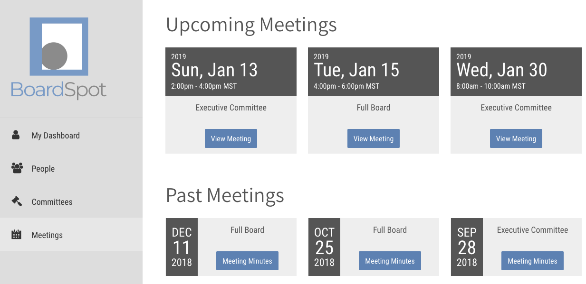
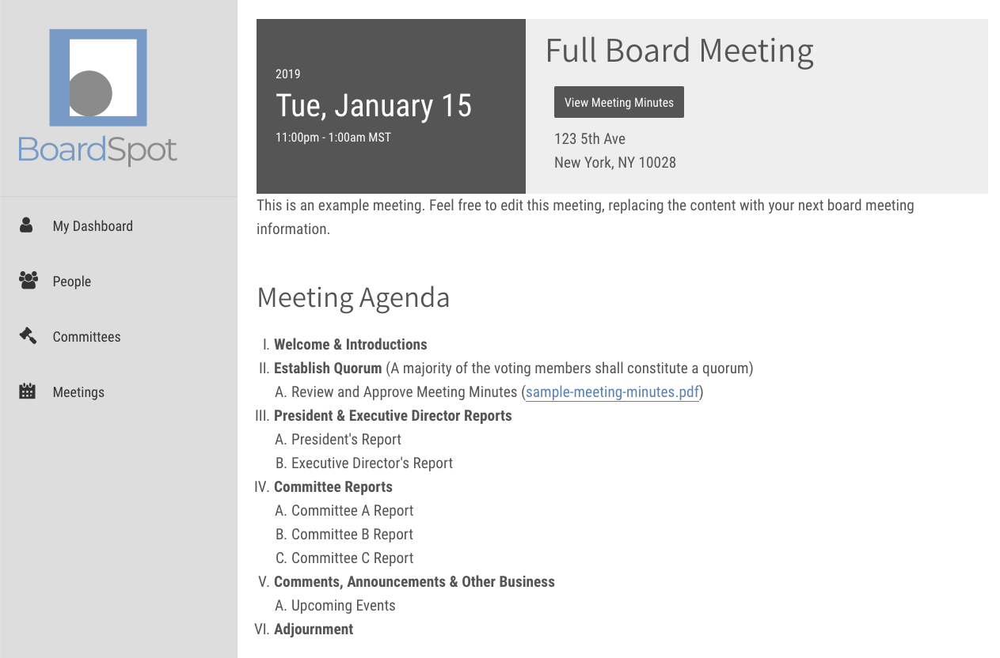

# Meetings

## Meetings Home Page

## Meeting Page

The meeting page displays all relevant information for an upcoming or past meeting. 

### When & Where

At the top of the meeting page, the date and location of the meeting are displayed in a colored box.

### Meeting Agenda

The meeting agenda, along with all supporting documents, should be reviewed in preparation for the board meeting.

### Meeting Minutes

After the meeting minutes have been approved, the organization admin will upload the meeting minutes directly to the meeting.

