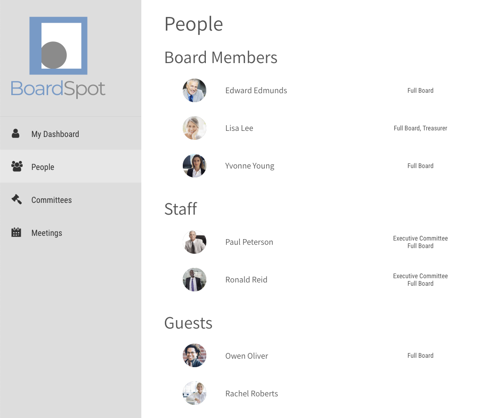

# People

###  Board Members

Board members can view information and documents across the entire organization.

### Staff

Staff can view information and documents across the entire organization. 

### Guests

Guests can only view information related to the committees they are members of. The guest role is useful for advisory board members, and nonprofit consultants who need access to a limited set of information.

